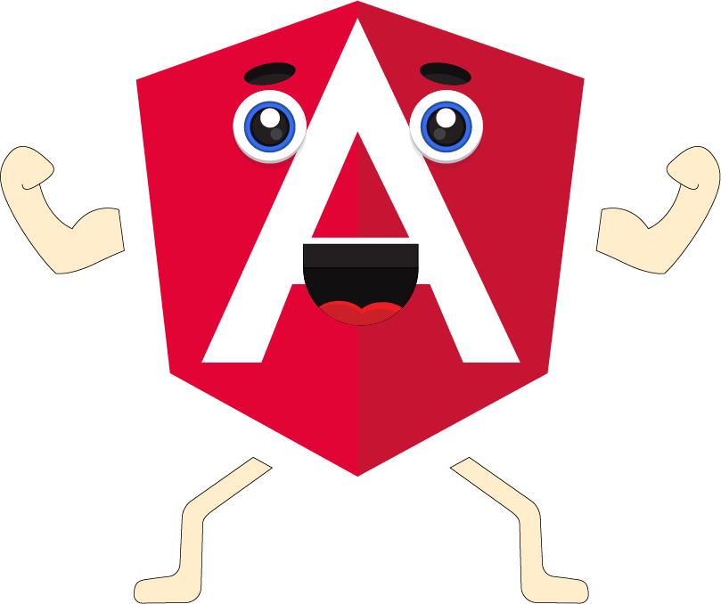
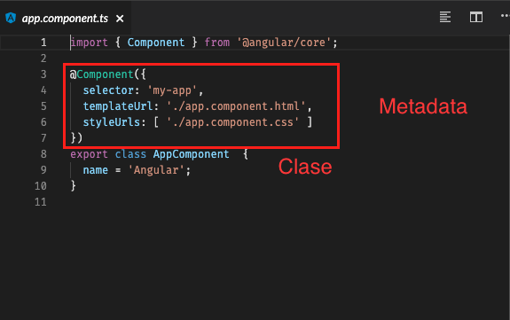
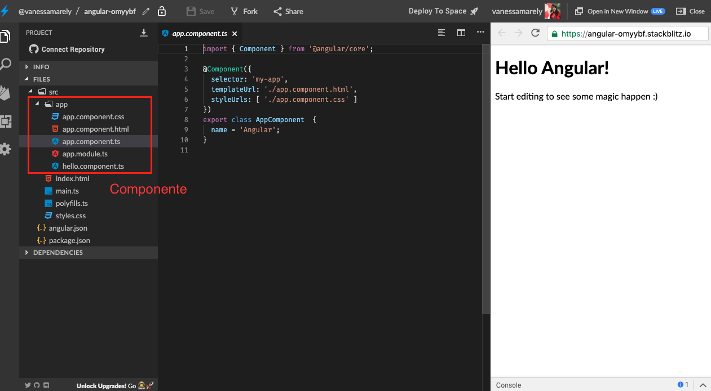
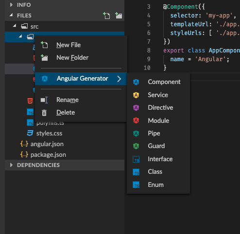
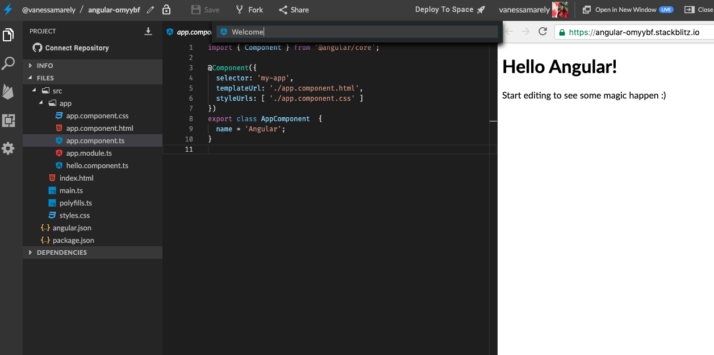
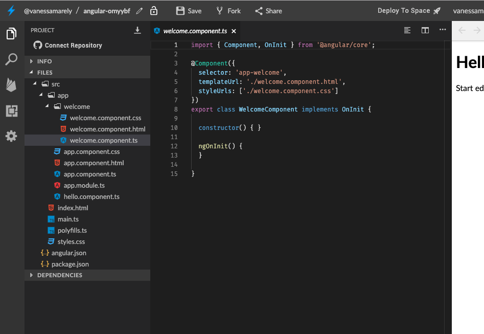

# 🎈Componentes 🎈

Existen muchos conceptos básicos de Angular que se pueden mirar individualmente, aunque también conviene conocerla desde sus entrañas. Desde allí, una aplicación en Angular está compuesta por un conjunto de componentes y servicios, pero en esta sección vamos a abordar a los primeros.

## **¿Qué es un Componente?** 📦

Si miramos un  componente desde una definición muy básica que es un elemento que compone a un todo y si lo llevamos a un punto de vista anatómico del ser humano, este puede ser un brazo, una pierna, etc.  




Un componente es un elemento reutilizable. Puede ser desde un elemento HTML como un &lt;button&gt; hasta una lista \(&lt;ul&gt;&lt;li&gt;&lt;/li&gt;&lt;/ul&gt;\), un &lt;header&gt;, un &lt;section&gt;, o un conjunto de etiquetas o elementos &lt;div&gt; que tengan una funcionalidad en particular.  



 Intenta en tus aplicaciones no usar tantos &lt;div&gt; utiliza correctamente la semántica del HTML, con esto quiero decir que es bueno usar elementos &lt;section&gt; o &lt;article&gt; donde los requieres en lugar de poner un &lt;div&gt; que haga las veces de los elementos anteriores.


## **¿Qué es un componente en Angular?** 🅰️


Un componente en Angular es un elemento que está compuesto por:

* Un archivo que será nuestro Template \(app.component.html\), el cual es nuestro HTML, que es el que se va a visualizar en la interfaz de usuario, la vista o en términos más simples lo que vas a ver en la página. 
* Un archivo de lógica, la cual es la que pondremos en un archivo .ts \(como por ejemplo app.component.ts\), ese archivo debe incluir una clase y esta es la que va a contener las propiedades que se van a usar en la vista \(HTML\) y los métodos que será las acciones que se ejecutarán en la vista. En este archivo de lógica también se incluye una metadata, que es definida con un decorador,  que identifica a Angular como un componente.
* Un archivo para el CSS \(podemos usar un preprocesador como SASS o LESS\), donde incluiremos los estilos, lo que nos ayuda a hacer bonita nuestra aplicación.



La extensión .ts hace alusión a Typescript, el cual es el lenguaje usado en Angular y es un superset de JavaScript.





**¿Qué es un decorador?** 

Si vamos a un término muy técnico, un decorador es una implementación de un patrón de diseño de software que permite extender una función dentro de otra función, sin modificar la original de la que se está extendiendo. En términos simples un decorador nos permite decorar una función a la cual deseamos especificarle unos metadatos, en ellos se informa sobre la función y sus comportamientos. Las funciones decoradoras inician por una "@" y a continuación tienen un nombre.  


Adicional a los dos anteriores que son los principales en nuestro componente podemos ir añadiendo más archivos de acuerdo a la necesidad que tengamos en nuestro proyecto.

Como por ejemplo:

* Un archivo para el test, donde podemos incluir nuestras pruebas unitarias.

Y podemos incluir muchos archivos más.

Debemos pensar en una aplicación de Angular como un conjunto de componentes que trabajando conjuntamente van a permitir que nuestro usuario tenga la mejor experiencia posible.

Cuando iniciamos nuestra aplicación en Angular usando **Stackblitz**, la aplicación nos crea un componente ‘App’ que contiene 5 archivos, donde pondremos en ellos el HTML, la lógica de nuestro componente, los estilos, las pruebas unitarias, y el app module, como lo muestra la imagen adjunta:



En Stackblitz podemos crear más componentes solo con dar clic derecho sobre una de las carpetas, vamos a la opción ‘Angular Generator’



Seleccionamos componente y aparece un campo donde ingresamos el nombre de nuestro componente y daremos enter.



Una vez presionamos enter se nos ha creado un componente nuevo, con la misma estructura de archivos del componente ‘App’



Cuando estamos creando un proyecto en Angular usando el CLI y ejecutando el siguiente comando:

```text
ng new my-app
```

Creamos toda la estructura inicial de un proyecto en Angular que incluye el componente App.  
Si deseamos crear más componentes solo debemos ejecutar el siguiente comando:

```text
ng generate component <name> [options]

```

Se puede usar la forma abreviada:

```text
ng g c <name> [options]

```

