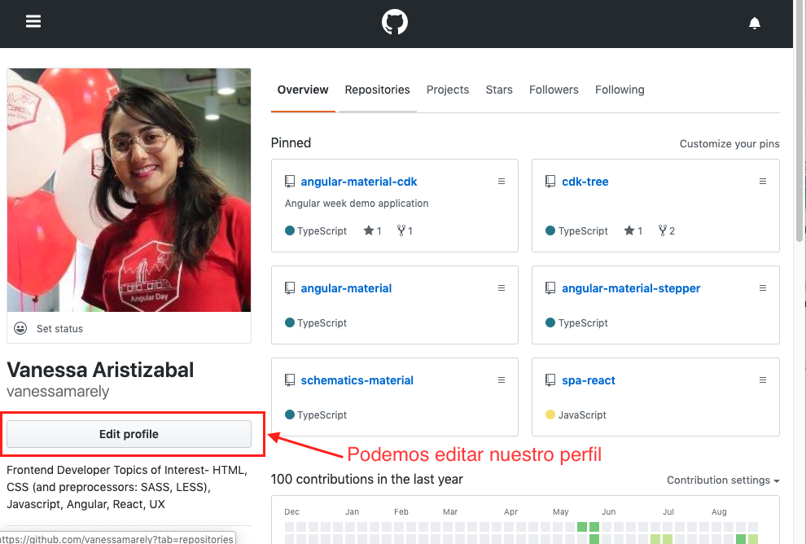
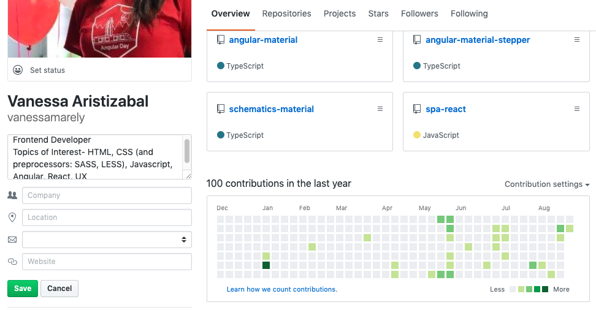
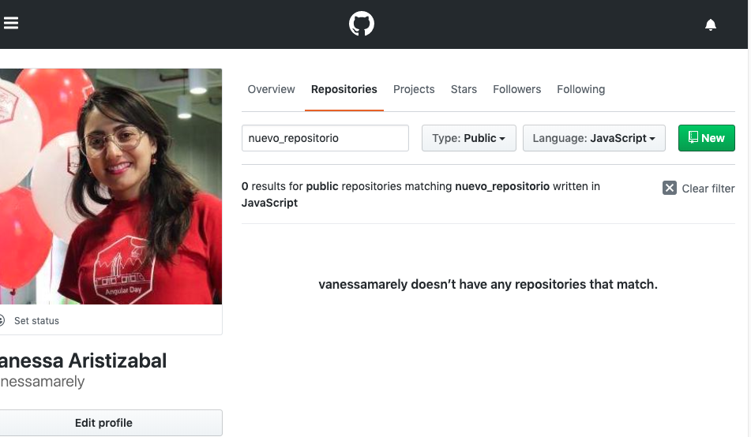
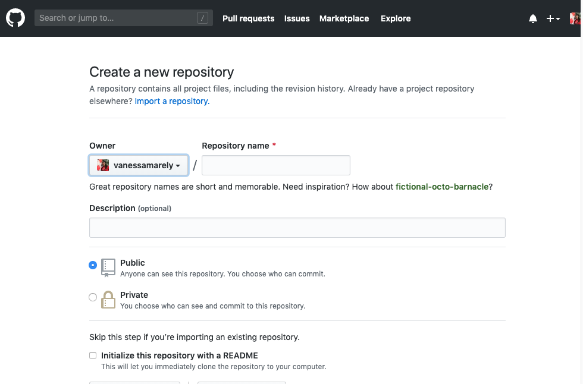
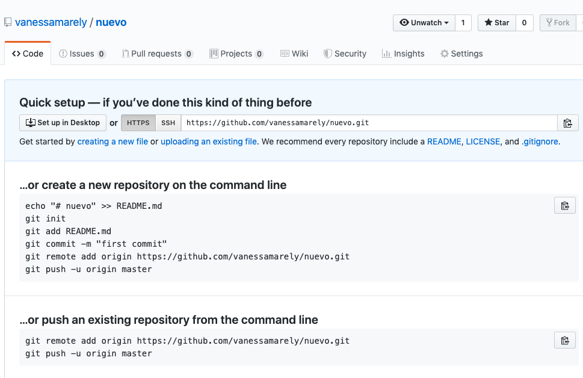

# 😺 GitHub 😺

## ¿Qué es GitHub?

GitHub es un sitio web y un servicio en la nube que ayuda a los desarrolladores a almacenar y administrar su código.

Permite llevar un registro y control de cualquier cambio en el código. 

Hay dos principios importantes que se deben conocer: 

* Control de Versión
* Git

### ¿Qué es Control de Versión?

Nos permite llevar un registro y control del código, permitiendo trabajar de forma segura en los proyectos.

### ¿Qué es Git? 

Git es un **sistema de control específico de versión distribuida**. El código y su historial se encuentran disponibles localmente en la computadora de todo desarrollador.

## **Como crear una cuenta en GitHub 📝**

Construir nuestra cuenta de GitHub es muy sencillo, vamos a seguir los siguientes pasos para crearla:

### **‌Paso 1**

**‌**En el navegador de preferencia vamos a colocar: **github.com**

### **Paso 2**

**‌**Vamos a llenar el siguiente formulario:

Al diligenciar el formulario damos clic en el botón "Sign up for gitHub" y confirmamos el correo que recibimos.

**‌**Una vez confirmada nuestra cuenta, podemos ir a nuestro espacio de GitHub y empezar a crear nuestros repositorios y visitar los que ya tenemos creados. Además de personalizarlo editando nuestro perfil.

## **Editar el perfil 🎈**

**‌**Podemos editar nuestro perfil dando clic en el botón "Edit profile".

Editamos el texto del perfil y podemos colocar nuestra ubicación, correo y página personal y guardamos.  
****

## **Crear un repositorio ✍️**

**‌**Para crear un nuevo repositorio se debe seleccionar la pestaña de "**Repositories**" y damos clic en el botón "**New**".

Al seleccionar el botón "**New**" nos aparecerá una página donde vamos a colocar el nombre del repositorio y vamos a dar clic en el botón "**Create repository**"  

Al seleccionar el botón nos quedará una página con la siguiente información que podemos usar para subir a GitHub un proyecto existente en ese repositorio o ir creando nuestros archivos e ir subiendolos a este repositorio.  

