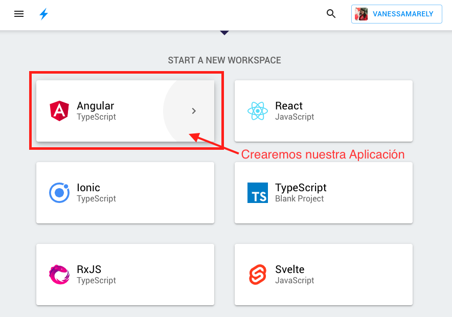

# 🧔🏻 Interpolación {{}} 🧔🏻

## ¿Qué es la interpolación?


La interpolación es su definición más básica nos permite obtener la información  definida en la lógica y mostrarla en el HTML.

En Interpolación se utiliza la sintaxis `{{ valor }}`

```markup
<h3>2 + 2 es igual a {{2 + 2}}</h3>
```


 se usan las dobles llaves {{}}, que visualmente se parece a un mostacho o bigote.


A la interpolación, se le conoce como interpolación de cadenas, también conocida en inglés como "string interpolation".

A su sintaxis se le conoce como "moustache syntax" o sintaxis de bigote

Lo que se coloca entre las dobles llaves son llamadas expresiones. Podemos crear expresiones simples y complejas.

Cualquier expresión al final de cuentas se convertirá en una cadena y eso es lo que se colocará en la vista del componente.

Podemos ver expresiones con operaciones matemáticas.

```text
{{ 2 + 2 }}
```

Expresiones con operadores lógico de negación:

```text
{{ !valor }}
```

Expresiones que son devueltas en un método de componente. Lo que devuelva ese método es lo que se colocará en el template.

```text
{{ metodoComponente() }}
```

## Reto Básico

Vamos a crear una mini galería doónde usaremos el concepto de interpolación. 

Para nuestra App vamos a seguir los siguientes pasos:

### Paso 1

Crearemos nuestro "**Hello Angular**", usando **stackblitz**, podemos ver la guía de **Stackblitz** en la sección de "Guías útiles" .

Vamos a la página de **stackblitz.com** y creamos nuestra App de Angular.





### Paso 2

Vamos a ir al archivo "**app.component.html**", seleccionamos el contenido y lo borramos.


